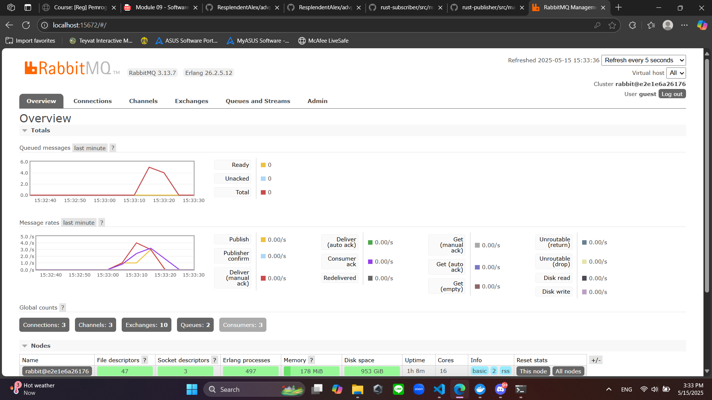

## AdvProg 2024/2025 - Tutorial 09

## a. What is amqp? 
AMQP (Advanced Message Queuing Protocol) is an open standard application layer protocol for message-oriented middleware. The protocol enables communication between application layers by sending messages between them, regardless of the programming language or platform used. 

## b. What does `guest:guest@localhost:5672` mean?
The first `guest` refers to the username used to authenticate with the message broker, while the second `guest` is the password associated with the username. `localhost:5672` shows the port number that AMQP uses for non-secure connections (5672) and the hostname of the machine where the message broker is being ran (locally). 

## Three Subscribers

As shown in the graph, the spike's max value is not as high as previous ones, and it is quicker to be handled. This is because each running subscriber instance is considered to be unique, and will be able to accept data from the queue separately. Once the data is received by one application, the other running instances would not be able to get that same data, thus the quicker request resolve.